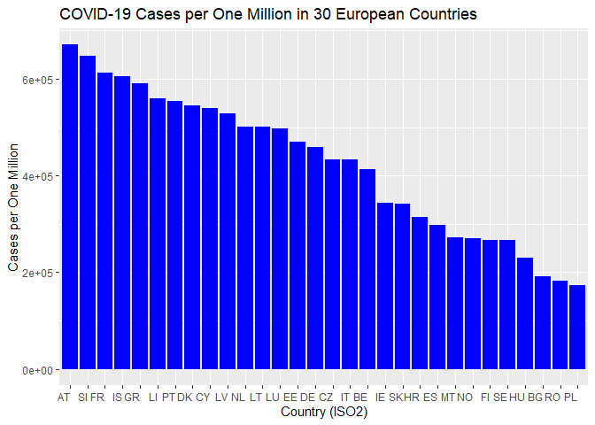
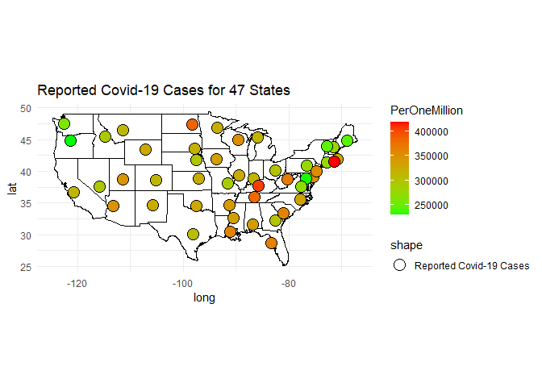

`disease.sh-Open Disease Data API` Vigenette
================
Joy Zhou
2023-10-03

- <a href="#requirements" id="toc-requirements">Requirements</a>
- <a href="#load-the-libraries-that-i-needed-to-build-this-vigenette"
  id="toc-load-the-libraries-that-i-needed-to-build-this-vigenette">Load
  the libraries that I needed to build this <code>vigenette</code></a>
- <a href="#api-interaction-and-helper-functions"
  id="toc-api-interaction-and-helper-functions">API Interaction and Helper
  Functions</a>
  - <a href="#countryvaccine"
    id="toc-countryvaccine"><code>CountryVaccine</code></a>
  - <a href="#countryvaccine30day"
    id="toc-countryvaccine30day"><code>CountryVaccine30day</code></a>
  - <a href="#extracttimeline"
    id="toc-extracttimeline"><code>extractTimeline</code></a>
  - <a href="#statevaccine"
    id="toc-statevaccine"><code>stateVaccine</code></a>
  - <a href="#countrycovidcase"
    id="toc-countrycovidcase"><code>countryCovidcase</code></a>
  - <a href="#countrypop" id="toc-countrypop"><code>countryPop</code></a>
  - <a href="#statecovidcase"
    id="toc-statecovidcase"><code>stateCovidCase</code></a>
  - <a href="#continentcovid"
    id="toc-continentcovid"><code>continentCovid</code></a>
  - <a href="#cleanvaccinedata"
    id="toc-cleanvaccinedata"><code>Cleanvaccinedata</code></a>
  - <a href="#variant" id="toc-variant"><code>Variant</code></a>
- <a href="#data-exploration" id="toc-data-exploration">Data
  Exploration</a>
- <a href="#wrap-up" id="toc-wrap-up">Wrap up</a>

In this vignette, I will provide instructions on reading and summarizing
data from the `disease.sh-Open Disease Data API`. I will develop a set
of functions to access and retrieve specific data of interest from the
APIs. Additionally, I will illustrate the process of conducting data
analysis using various R packages.

# Requirements

To use the functions for interacting with the
`disease.sh-Open Disease Data` API, I used the following packages:

- [`tidyverse`](https://www.tidyverse.org/): for data manipulation,
  visualization, and analysis.  
- [`jsonlite`](https://cran.r-project.org/web/packages/jsonlite/): to
  convert JSON data to data frame.  
- [`httr2`](https://httr2.r-lib.org/):to access API.  
- [`maps`](https://cran.r-project.org/web/packages/maps/index.html): to
  create choropleth map.  
- [`viridis`](https://cran.r-project.org/web/packages/viridis/index.html):
  to make color map.

# Load the libraries that I needed to build this `vigenette`

``` r
library(httr2)
library(httr)
library(jsonlite)
library(tidyverse)
library(sjmisc)
library(ggplot2)
library(dplyr)
library(maps)
library(viridis)
```

# API Interaction and Helper Functions

## `CountryVaccine`

I wrote a function `CountryVaccine` for a user to interact with the
`countries` endpoint of the `Open Disease API`. It returns a data frame
with key metrics (country and timeline) for every country. The
`timeline` column represents the number of vaccine doses collected
today. It accepts one argument, country, and the default value is “all”.
The user may enter a country’s name to get only data for a specific
country.

``` r
CountryVaccine <- function(country = "all") {
  ###
  # This function returns raw JSON data on vaccine coverage from the Open Disease API.
  ###
  
  # Argument Validation
  if (!is.character(country)) {
    stop("ERROR: 'country' argument should be a character.")
  }
  country <- trimws(country)  # Remove leading/trailing whitespace
  
  # Construct the API URL
  api_url <- "https://disease.sh/v3/covid-19/vaccine/coverage/countries?lastdays=1"
  
  # Get the data from the API
  response <- httr::GET(api_url)
  
  # Check if the response is successful
  if (httr::http_status(response)$category != "Success") {
    stop("ERROR: Failed to retrieve data from the API.")
  }
  
  # Parse the JSON data
  data <- jsonlite::fromJSON(httr::content(response, as = "text"))
  
  # Check if the API response contains the "country" data
  if (!"country" %in% names(data)) {
    stop("ERROR: The API response does not contain the 'country' data.")
  }
  
  # If country does not equal "all", filter the data for the specified country
  if (country != "all") {
    # Check if the specified country is in the data
    if (country %in% data$country) {
      # Filter the data for the specified country
      data <- data[data$country == country, ]
    } else {
      # If the specified country is not found, return an empty data frame
      data <- data.frame(country = character(0), timeline = list())
    }
  }
  
  # Return the raw JSON data
  return(data)
}

#call the function
#ConVacdata <- CountryVaccine(country = "China")
ConVacdata <- CountryVaccine()
```

## `CountryVaccine30day`

I’ve created the `CountryVaccinefor30day` function for a user to
interact with the `countries` endpoint of the `Open Disease API` to
retrieve data for countries that have been actively administering
vaccines for a 30-day period. This function returns a data frame
containing essential metrics such as the country’s name and its
vaccination timeline spanning 30 days. By default, the function collects
data for all countries, but users can specify a particular country’s
name to obtain data exclusively for that country.

``` r
CountryVaccinefor30day <- function(country = "all") {
  ###
  # This function returns raw JSON data on vaccine coverage from the Open Disease API.
  ###
  
  # Argument Validation
  if (!is.character(country)) {
    stop("ERROR: 'country' argument should be a character.")
  }
  country <- trimws(country)  # Remove leading/trailing whitespace
  
  # Construct the API URL
  api_url <- "https://disease.sh/v3/covid-19/vaccine/coverage/countries?lastdays=30&fullData=false"
  
  # Get the data from the API
  response <- httr::GET(api_url)
  
  # Check if the response is successful
  if (httr::http_status(response)$category != "Success") {
    stop("ERROR: Failed to retrieve data from the API.")
  }
  
  # Parse the JSON data
  data <- jsonlite::fromJSON(httr::content(response, as = "text"))
  
  # Check if the API response contains the "country" data
  if (!"country" %in% names(data)) {
    stop("ERROR: The API response does not contain the 'country' data.")
  }
  
  # If country does not equal "all", filter the data for the specified country
  if (country != "all") {
    # Check if the specified country is in the data
    if (country %in% data$country) {
      # Filter the data for the specified country
      data <- data[data$country == country, ]
    } else {
      # If the specified country is not found, return an empty data frame
      data <- data.frame(country = character(0), timeline = list())
    }
  }
  
  # Return the raw JSON data
  return(data)
}

#call the function
countrydata30day <- CountryVaccinefor30day()
```

## `extractTimeline`

I wrote a helper function `extractTimeline` to extract both the date and
the corresponding number from the `timeline` data frame.

``` r
# Helper function to extract date and number from timeline data frame
extractTimeline <- function(timeline_df) {
  # Check if the "timeline" column contains a list
  if (is.list(timeline_df$timeline)) {
    # Flatten the list into a data frame
    timeline_df <- do.call(rbind, timeline_df$timeline)
    
    # Rename the columns for clarity
    colnames(timeline_df) <- c("date", "number")
    
    # Convert the Date column to Date class using the specified format
    date_format <- "%m/%d/%Y"
    timeline_df$date <- as.Date(timeline_df$date, format = date_format)
  }
  
  return(timeline_df)
}

# Call the helper function to extract date and number
# call the function
ConVacdata <- CountryVaccine()

timeline_data <- ConVacdata$timeline
timeline_extracted <- extractTimeline(timeline_data)

## timeline_data data frame
col_names <- names(timeline_data)  # Get the column names
values <- as.numeric(unlist(timeline_data))  # Convert values to numeric

# Create a new data frame with two columns: Date and Number
timeline_extracted <- data.frame(
  date = as.Date(col_names, format = "%m/%d/%y"),  # Convert to Date format
  number = values
)
timeline_extracted$country <- ConVacdata$country

head(timeline_extracted) 
```

    ## # A tibble: 6 × 3
    ##   date         number country 
    ##   <date>        <dbl> <chr>   
    ## 1 2023-10-10 21716120 Afghani…
    ## 2 2023-10-10  3087677 Albania 
    ## 3 2023-10-10 15267442 Algeria 
    ## 4 2023-10-10   157062 Andorra 
    ## 5 2023-10-10 27309449 Angola  
    ## 6 2023-10-10    24604 Anguilla

Call the `CountryVaccine` function and `extractTimeline` function to
make sure the functions are working fine.

``` r
#call the functions

ConVacdata <- CountryVaccine()
timeline_data <- ConVacdata$timeline
timeline_extracted <- extractTimeline(timeline_data)

## timeline_data data frame
col_names <- names(timeline_data)  # Get the column names
values <- as.numeric(unlist(timeline_data))  # Convert values to numeric

# Create a new data frame with two columns: Date and Number
timeline_extracted <- data.frame(
  date = as.Date(col_names, format = "%m/%d/%y"),  # Convert to Date format
  number = values
)
timeline_extracted$country <- ConVacdata$country 

head(timeline_extracted) #contains three columns: country, date, and number
```

    ## # A tibble: 6 × 3
    ##   date         number country 
    ##   <date>        <dbl> <chr>   
    ## 1 2023-10-10 21716120 Afghani…
    ## 2 2023-10-10  3087677 Albania 
    ## 3 2023-10-10 15267442 Algeria 
    ## 4 2023-10-10   157062 Andorra 
    ## 5 2023-10-10 27309449 Angola  
    ## 6 2023-10-10    24604 Anguilla

``` r
extracted <- timeline_extracted[c("date", "number", "country")]
```

## `stateVaccine`

I’ve created a `stateVaccine` function to retrieve data for states and
territories in the United States that have reported 30 days of
vaccination records. It returns a data frame containing essential
metrics (state and timeline) for each state. The function accepts one
argument, `state`, with a default value of `all`. Users can specify a
state’s name to retrieve data for a specific state.

``` r
stateVaccine <- function(state = "all") {
  ###
  # This function returns raw JSON data on vaccine coverage from the Open Disease API.
  ###
  
  # Argument Validation
  if (!is.character(state)) {
    stop("ERROR: 'state' argument should be a character.")
  }
  country <- trimws(state)  # Remove leading/trailing whitespace
  
  # Construct the API URL
  api_url <- "https://disease.sh/v3/covid-19/vaccine/coverage/states?lastdays=1"
  
  
  # Get the data from the API
  response <- httr::GET(api_url)
  
  # Check if the response is successful
  if (httr::http_status(response)$category != "Success") {
    stop("ERROR: Failed to retrieve data from the API.")
  }
  
  # Parse the JSON data
  data <- jsonlite::fromJSON(httr::content(response, as = "text"))
  
  # Check if the API response contains the "state" data
  if (!"state" %in% names(data)) {
    stop("ERROR: The API response does not contain the 'state' data.")
  }
  
  # If state does not equal "all", filter the data for the specified state
  if (state != "all") {
    # Check if the specified state is in the data
    if (state %in% data$state) {
      # Filter the data for the specified state
      data <- data[data$state == state, ]
    } else {
      # If the specified country is not found, return an empty data frame
      data <- data.frame(state = character(0), timeline = list())
    }
  }
  
  # Return the raw JSON data
  return(data)
}

#call the function
stateVac <- stateVaccine()
```

## `countryCovidcase`

I wrote this function to interact with the `countries` endpoint of the
total Covid-19 case records for all countries. It returns a `data.frame`
containing 231 observations and 23 variables, including country,
countryInfo, cases, deaths, population, and more. By default, the
function collects data for all countries, but users can specify a
particular country’s name to obtain data exclusively for that country.

``` r
countryCovidcase <- function(country="all") {
  # Construct the API URL
  api_url <- "https://disease.sh/v3/covid-19/countries"
  
  # Get the data from the API
  response <- httr::GET(api_url)
  
  # Check if the response is successful
  if (httr::http_status(response)$category != "Success") {
    stop("ERROR: Failed to retrieve data from the API.")
  }
  
  # Parse the JSON data
  data <- jsonlite::fromJSON(httr::content(response, as = "text"))
  
  # Return the data frame
  return(data)
}
# call the function
#covid_data <- countryCovidcase()
```

## `countryPop`

I’ve written a helper function called `countryPop` to facilitate
interactions with the `countries` endpoint of the
`disease.sh-Open Disease Data API`. This function allows users to input
either a specific country’s name or choose “all” to obtain population
data for all countries. It will prove useful in other functions that
require population data from the API.

``` r
countryPop <- function(country = "all") {
  if (country == "all") {
    # If country is "all," return populations of all countries
    api_url <- "https://disease.sh/v3/covid-19/countries"
    
    # Fetch data from the API
    response <- httr::GET(api_url)
    
    # Check if the response is successful
    if (httr::http_status(response)$category != "Success") {
      stop("ERROR: Failed to retrieve data from the API.")
    }
    
    # Parse the JSON data
    data <- jsonlite::fromJSON(httr::content(response, as = "text"))
    
    # Extract and return a data frame with country names and populations
    population_data <- data.frame(
      Country = data$country,
      Population = data$population
    )
    
    return(population_data)
  } else {
    # Construct the API URL to get population data for a specific country
    api_url <- paste0("https://disease.sh/v3/covid-19/countries/", country)
    
    # Fetch data from the API
    response <- httr::GET(api_url)
    
    # Check if the response is successful
    if (httr::http_status(response)$category != "Success") {
      stop("ERROR: Failed to retrieve data from the API.")
    }
    
    # Parse the JSON data
    data <- jsonlite::fromJSON(httr::content(response, as = "text"))
    
    # Extract and return the population of the specified country
    population <- data$population
    
    return(population)
  }
}

# call the function
data1 <- countryPop()
data2 <- countryPop(country = "China")
```

## `stateCovidCase`

I wrote this function to interact with the `states` endpoint of the
total real time Covid-19 case records updated by every 10 minutes for
all states and territories. It accepts one argument, state, and the
default value is “all”. The user may enter a state’s name to get only
data for a specific state.

``` r
stateCovidCase <- function(state = "all") {
  ###
  # This function returns COVID-19 data for all states and territories or a specific state.
  ###
  
  # Argument Validation
  if (!is.character(state)) {
    stop("ERROR: 'state' argument should be a character.")
  }
  state <- trimws(state)  # Remove leading/trailing whitespace
  
  # Construct the API URL
  api_url <- "https://disease.sh/v3/covid-19/states"
  
  # Get the data from the API
  response <- httr::GET(api_url)
  
  # Check if the response is successful
  if (httr::http_status(response)$category != "Success") {
    stop("ERROR: Failed to retrieve data from the API.")
  }
  
  # Parse the JSON data
  data <- jsonlite::fromJSON(httr::content(response, as = "text"))
  
  # If state does not equal "all", filter the data for the specified state
  if (state != "all") {
    data <- data[data$state == state, ]
  }
  
  # Return the data frame
  return(data)
}

# Example usage:
# To get data for a specific state (e.g., California):
california_data <- stateCovidCase(state = "California")
# To get data for all states and territories:
all_states_data <- stateCovidCase()
```

## `continentCovid`

I wrote a helper function named `continent` to interact with the
`countries` endpoint of the `disease.sh-Open Disease Data API`. This
function enables users to retrieve data specific to a particular
continent.

``` r
continent <- function(continent_name) {
  # Fetch data from the URL
  output <- fromJSON("https://disease.sh/v3/covid-19/countries/")
  
  # Check if the continent_name argument is provided
  if (!missing(continent_name)) {
    # Filter the data for the specified continent
    output <- output[output$continent == continent_name, ]
  }
  
  return(output)
}
# call the function
contientcases <- continent(continent_name = "Asia")
```

## `Cleanvaccinedata`

I created `Cleanvaccinedata` to clean the vaccine data set that
retrieved from the `disease.sh-Open Disease Data API`.

``` r
Cleanvaccinedata <- function(data, data_type) {
  timeline_data <- data$timeline
  timeline_extracted <- extractTimeline(timeline_data)
  
  # Get the column names
  col_names <- names(timeline_data)
  values <- as.numeric(unlist(timeline_data))
  
  # Create a new data frame with two columns: Date and Number
  timeline_extracted <- data.frame(
    date = as.Date(col_names, format = "%m/%d/%y"),  # Convert to Date format
    number = values
  )
  
  # Assign the location_column to the data frame
  timeline_extracted$location <- data[[data_type]]
  
  # Select columns of interest
  extracted <- timeline_extracted[c("date", "number", "location")]
  
  return(extracted)
}

# Example usage for country data
country_data <- CountryVaccine()
clean_country_data <- Cleanvaccinedata(country_data, data_type = "country")
```

## `Variant`

I created `Variant` function to retrieve the data from API using the
`/v3/covid-19/variants/countries/ endpoint`. These data came from The
European Surveillance System -TESSy, provided by 30 counties including
[`Austria, Belgium, Bulgaria, Croatia, Cyprus, Czechia, Denmark, Estonia, Finland, France, Germany, Greece, Hungary, Iceland, Ireland, Italy, Latvia, Liechtenstein, Lithuania, Luxembourg, Malta, Netherlands, Norway, Poland, Portugal, Romania, Slovakia, Slovenia, Spain and Sweden`](https://www.ecdc.europa.eu)
and released by ECDC updated every week.

``` r
Variant <- function(country) {
  baseURL <- "https://disease.sh"
  endpoint <- "/v3/covid-19/variants/countries/"
  
  # URL encode the country name
  encoded_country <- URLencode(country)
  apiURL <- paste0(baseURL, endpoint, encoded_country)

  # Make an API request to retrieve data
  response <- httr::GET(apiURL)

  # Check if the response is successful
  if (httr::http_status(response)$category != "Success") {
    stop("ERROR: Failed to retrieve data from the API.")
  }

  # Parse the JSON data
  data <- jsonlite::fromJSON(httr::content(response, as = "text"))

  # Return the retrieved data
  return(data)
}
```

# Data Exploration

Call the `CountryVaccine` and `countryCovidcase` functions to get data
sets then combine them by country. I will do the further analysis based
on the combined data set

``` r
df1 <- CountryVaccine() %>% 
  Cleanvaccinedata(data_type = "country") %>%
  rename(country = location)

df2 <- countryCovidcase()
Countrycombined <- inner_join(df1, df2, by = "country") %>%
    # create a new variable
    mutate(dosePerOneMillion = ((number/population) * 1000000))
```

Check the correlation between COVID-19 cases and the vaccinated
population.

``` r
cor(Countrycombined %>% select(oneCasePerPeople, oneDeathPerPeople,
                           recoveredPerOneMillion,  
                           dosePerOneMillion, casesPerOneMillion
                       )) %>% 
                round(3)
```

    ##                        oneCasePerPeople
    ## oneCasePerPeople                  1.000
    ## oneDeathPerPeople                 0.601
    ## recoveredPerOneMillion           -0.283
    ## dosePerOneMillion                -0.295
    ## casesPerOneMillion               -0.318
    ##                        oneDeathPerPeople
    ## oneCasePerPeople                   0.601
    ## oneDeathPerPeople                  1.000
    ## recoveredPerOneMillion            -0.237
    ## dosePerOneMillion                 -0.202
    ## casesPerOneMillion                -0.264
    ##                        recoveredPerOneMillion
    ## oneCasePerPeople                       -0.283
    ## oneDeathPerPeople                      -0.237
    ## recoveredPerOneMillion                  1.000
    ## dosePerOneMillion                       0.453
    ## casesPerOneMillion                      0.898
    ##                        dosePerOneMillion
    ## oneCasePerPeople                  -0.295
    ## oneDeathPerPeople                 -0.202
    ## recoveredPerOneMillion             0.453
    ## dosePerOneMillion                  1.000
    ## casesPerOneMillion                 0.517
    ##                        casesPerOneMillion
    ## oneCasePerPeople                   -0.318
    ## oneDeathPerPeople                  -0.264
    ## recoveredPerOneMillion              0.898
    ## dosePerOneMillion                   0.517
    ## casesPerOneMillion                  1.000

A negative correlation exists between `dosePerOneMillion` and both
`oneCasePerPeople` and `oneDeathPerPeople`, with correlation
coefficients (r scores) of -0.295 and -0.202, respectively.
Additionally, there is a positive correlation between
`dosePerOneMillion` and `recoveredPerOneMillion`, indicated by an r
score of 0.453, as well as a positive correlation between
`dosePerOneMillion` and `casesPerOneMillion`, with an r score of 0.517.

Numeric variables summary

``` r
Countrycombined %>%
  group_by(continent) %>%
  select(casesPerOneMillion, deathsPerOneMillion, recoveredPerOneMillion, dosePerOneMillion) %>%
  summarize(n = n(), 
            avrcases = mean(casesPerOneMillion), 
            medcases = median(casesPerOneMillion),
            avrdeaths = mean(deathsPerOneMillion), 
            meddeaths = median(deathsPerOneMillion),
            avrrecovered = mean(recoveredPerOneMillion), 
            medrecovered = median(recoveredPerOneMillion),
            avrdose = mean(dosePerOneMillion),
            meddose = median(dosePerOneMillion))
```

    ## Adding missing grouping
    ## variables: `continent`

    ## # A tibble: 6 × 10
    ##   continent         n avrcases
    ##   <chr>         <int>    <dbl>
    ## 1 Africa           54   33538.
    ## 2 Asia             49  160561.
    ## 3 Australia-Oc…    17  236213.
    ## 4 Europe           47  401337.
    ## 5 North America    34  185042.
    ## 6 South America    13  176257.
    ## # ℹ 7 more variables:
    ## #   medcases <dbl>,
    ## #   avrdeaths <dbl>,
    ## #   meddeaths <dbl>,
    ## #   avrrecovered <dbl>,
    ## #   medrecovered <dbl>,
    ## #   avrdose <dbl>, …

European countries report the highest average Covid-19 deaths, with an
average of 2717 deaths per one million people, followed closely by
countries in South America, which report an average of 2447 deaths per
one million people, the lowest average Covid-19 deaths (311.9 per one
million people) was reported in Africa countries. On the other hand,
countries in Australia-Oceania have the highest average number of
vaccinations received per one million people, while countries in Africa
have the lowest cumulative vaccinations.

I generated a scatter plot to visually represent the relationship
between reported Covid-19 cases and cumulative vaccinations.

``` r
# Create scatter plot for deaths
plot1 <- ggplot(Countrycombined, aes(x = casesPerOneMillion, y = dosePerOneMillion, color = continent)) +
    geom_point(shape = 1,      # Use hollow circles
               position = position_jitter(width = 1, height = .5)) + 
    facet_wrap(~ continent) +
    stat_smooth(method = lm, se = FALSE) + # add a fitted least squares line
    labs(x = "Reported Covid Cases (Per One Million)",
         y = "Cumulative Vaccinations (Per One Million)",
         color = "Continent",
         title = "Scatter Plots of Covid Cases vs Vaccinations Across Continent",
       ) +
    theme_minimal()
plot1
```

<!-- -->

The scatter plot reveals a positive correlation between reported
Covid-19 cases and cumulative vaccinations, consistently observed across
all continents.

To check the relationship between Covid-19 mortality and distributed
vaccination doses, scatter plots were created for the 50 countries with
the highest mortality rates and the 50 countries with the lowest
mortality rates.

``` r
# creat subset with a new variable 'mortality'
Subset <- Countrycombined %>% 
                 mutate(mortality = deathsPerOneMillion/casesPerOneMillion) %>%
                 select(country, mortality, dosePerOneMillion)
# Filter and select the top 50 countries with the highest mortality rate
top_50_highest <- Subset %>%
  arrange(desc(mortality)) %>%
  head(50) %>% mutate(group = "Top_50")

# Filter and select the bottom 50 countries with the lowest mortality rate
bottom_50_lowest <- Subset %>%
  arrange(mortality) %>%
  head(50) %>% mutate(group = "Bottom_50")

# Combine the top 10 highest and bottom 10 lowest countries
combined_data <- bind_rows(top_50_highest, bottom_50_lowest)

# Create a plot
plot2 <- ggplot(combined_data, 
               aes(x = mortality, y = dosePerOneMillion, color = group)) +
            geom_point(size = 2.5) +  # Increase the size of the dots
            # geom_smooth(method = "lm", color = "blue") +  # Add a linear regression trend line
            labs(title = "Scatter Plot of Mortality Rate vs. Distributed Vaccination Doses",
                 x = "Mortality Rate",
                 y = "Distributed Vaccination Doses per One Million People",
                 color = "Group") +
            theme_minimal()

# Display the plot
print(plot2)
```

<!-- -->

The scatter plot suggests that the 50 countries with the lowest
mortality rates generally had higher levels of distributed vaccination
doses. However, there were a few exceptions where countries with
relatively low vaccination doses still maintained low mortality rates.

I want to determine if the greater variety of variants is associated
with a higher cumulative count of Covid-19 cases. First, I examined the
`Countrycombined` dataset containing data for 30 countries that reported
variant information. I observed that `Austria` had the highest
cumulative COVID-19 cases(casesPerOneMillion), while `Poland` had the
lowest.

``` r
var_data <- Countrycombined %>% 
  filter(country %in% 
           c("Austria", "Belgium", "Bulgaria", "Croatia",
             "Cyprus", "Czechia", "Denmark", "Estonia", 
             "Finland", "France", "Germany", "Greece", 
             "Hungary", "Iceland", "Ireland", "Italy", 
             "Latvia", "Liechtenstein", "Lithuania", "Luxembourg", 
             "Malta", "Netherlands", "Norway", "Poland", 
             "Portugal", "Romania", "Slovakia", "Slovenia", 
             "Spain", "Sweden")) %>% 
             arrange(desc(casesPerOneMillion))

iso2_values <- var_data$countryInfo$iso2

# Create the bar chart
plot <- ggplot(var_data, 
               aes(x = reorder(factor(iso2_values), -casesPerOneMillion), 
                   y = casesPerOneMillion)) +
  geom_bar(stat = "identity", fill = "blue") +
  labs(title = "COVID-19 Cases per One Million in 30 European Countries",
       x = "Country (ISO2)",
       y = "Cases per One Million")

# Rotate x-axis labels for better readability (optional)
plot3 <- plot + theme(axis.text.x = element_text(angle = 0, hjust = 1))

# Display the bar chart
print(plot3)
```

<!-- -->

Subsequently, I retrieved variant data specifically for these two
countries and created two-way contingency tables to analyze the variants
in `Austria` and `Poland`.

``` r
data_A <- Variant("Austria")
data_A <- data_A %>%
             # Extract the first four characters as year
               mutate(year = substr(yearWeek, 1, 4),  
                      # Extract characters 6 and 7 as week
                      week = substr(yearWeek, 6, 7)) %>% 
  filter(numberDetectionsVariant != 0)
knitr::kable(table(data_A$year, data_A$variant),
             caption = "Counts of Variant Record Types by Year")
```

|      | AY.4.2 | B.1.1.529 | B.1.1.7 | B.1.1.7+E484K | B.1.351 | B.1.525 | B.1.617.1 | B.1.617.2 | B.1.621 | BA.1 | BA.2 | BA.2.75 | BA.3 | BA.4 | BA.4/BA.5 | BA.5 | BQ.1 | Other | P.1 | SGTF | UNK | XBB | XBB.1.5 | XBB.1.5+F456L |
|:-----|-------:|----------:|--------:|--------------:|--------:|--------:|----------:|----------:|--------:|-----:|-----:|--------:|-----:|-----:|----------:|-----:|-----:|------:|----:|-----:|----:|----:|--------:|--------------:|
| 2020 |      0 |         0 |       5 |             0 |       1 |       0 |         0 |         1 |       0 |    0 |    1 |       0 |    0 |    0 |         0 |    0 |    0 |    43 |   0 |    0 |  11 |   0 |       0 |             0 |
| 2021 |      9 |         7 |      77 |            24 |      49 |      26 |         8 |        93 |      16 |   17 |    5 |       0 |    0 |    1 |         0 |    0 |    0 |    30 |  34 |    1 |  52 |   0 |       0 |             0 |
| 2022 |      0 |        15 |       6 |             2 |       0 |       0 |         0 |        50 |       0 |   85 |  104 |      39 |    6 |   77 |        25 |   78 |   33 |    55 |   5 |    4 |  52 |  31 |       9 |             0 |
| 2023 |      0 |         0 |       0 |             0 |       0 |       0 |         0 |        16 |       0 |    6 |   33 |      54 |    0 |   19 |         0 |   39 |   39 |    29 |   0 |    0 |  13 |  47 |      62 |            44 |

Counts of Variant Record Types by Year

So far, 24 variants have been reported in `Austria`, spanning four
years. In 2020, 6 variants (B.1.1.529, B.1.351, B.1.617.2, BA.2, other,
UNK) were detected, followed by 16 (AY.4.2, B.1.1.529, B.1.1.7,
B.1.1.7+E484K, B.1.351, B.1.525, B.1.617.1, B.1.617.2, B.1.621, BA.1,
BA.2, BA.4, other, P.1, SGTF, UNK) in 2021, 18 (B.1.1.529, B.1.1.7,
B.1.1.7+E484K, B.1.617.2, BA.1, BA.2, BA.2.75, BA.3, BA.4, BA.4/BA.5,
Ba.5, BQ.1, other, P.1, SGTF, UNK, XBB, XBB.1.5) in 2022, and
12(B.1.617.2, BA.1, BA.2, BA.2.75, BA.4, BA.5, BQ.1, other, UNK, XBB,
XBB.1.5, XBB.1.5+F456) in 2023.

``` r
data_P <- Variant("Poland")
data_P <- data_P %>%
             # Extract the first four characters as year
               mutate(year = substr(yearWeek, 1, 4),  
                      # Extract characters 6 and 7 as week
                      week = substr(yearWeek, 6, 7)) %>% 
  filter(numberDetectionsVariant != 0)

knitr::kable(table(data_P$year, data_P$variant),
             caption = "Counts of Variant Record Types by Year")
```

|      | B.1.1.529 | B.1.1.7 | B.1.351 | B.1.525 | B.1.617.1 | B.1.617.2 | B.1.621 | BA.1 | BA.2 | BA.2.75 | BA.4 | BA.5 | BQ.1 | C.37 | Other | P.1 | UNK | XBB | XBB.1.5 | XBB.1.5+F456L |
|:-----|----------:|--------:|--------:|--------:|----------:|----------:|--------:|-----:|-----:|--------:|-----:|-----:|-----:|-----:|------:|----:|----:|----:|--------:|--------------:|
| 2020 |         0 |       2 |       0 |       0 |         0 |         1 |       0 |    0 |    0 |       0 |    0 |    0 |    0 |    0 |    36 |   0 |   0 |   0 |       0 |             0 |
| 2021 |         9 |      73 |      36 |       3 |         1 |        78 |       9 |    4 |    1 |       0 |    0 |    1 |    0 |    2 |    62 |  20 |  17 |   0 |       0 |             0 |
| 2022 |        15 |       1 |       0 |       0 |         3 |        25 |       0 |   30 |   72 |      29 |   45 |   67 |   26 |    0 |    26 |   0 |  11 |  12 |       1 |             0 |
| 2023 |         0 |       0 |       0 |       0 |         0 |         0 |       0 |    2 |   21 |      43 |    2 |   30 |   36 |    0 |     4 |   0 |   2 |  36 |      65 |            24 |

Counts of Variant Record Types by Year

From 2020 to 2024, a total of 14 variants have been reported in
`Poland`. In 2020, a single variant (other) was detected, followed by 7
variants (B.1.1.529, B.1.1.7, B.1.617.2, B.1.621, BA.1, other, UNK) in
2021, 11 variants (B.1.1.529, B.1.617.2, BA.1, BA.2, BA.2.75, BA.4,
BA.5, BQ.1, other, UNK, XBB) in 2022, and 5 variants (BA.2, BA.5, BQ.1,
XBB, XBB.1.5) in 2023.

Based on the contingency tables, we can conclude that the emergence of
new variants is associated with an increase in Covid-19 cases.

I aimed to determine the total count of reported variants across 30
European countries. To achieve this, I employed a loop to acquire the
`var30Coun` data set, which contains the reported variants for these 30
countries. Subsequently, I conducted further analyses using this data
set.

``` r
# List of 30 countries
countries <- c("Austria", "Belgium", "Bulgaria", "Croatia", "Cyprus", "Czechia", "Denmark", "Estonia", "Finland", "France", "Germany", "Greece", "Hungary", "Iceland", "Ireland", "Italy", "Latvia", "Liechtenstein", "Lithuania", "Luxembourg", "Malta", "Netherlands", "Norway", "Poland", "Portugal", "Romania", "Slovakia", "Slovenia", "Spain", "Sweden")

# Create an empty data frame to store the results
variants30 <- data.frame()

# Loop through the list of countries and call the 'variant' function for each
for (country in countries) {
  # Call your 'variant' function to retrieve data for the current country
  country_data <- Variant(country)
  
  # Add the retrieved data to the result data frame
  variants30 <- rbind(variants30, country_data)
}
  data <- variants30 %>%
# Extract the first four characters as year
               mutate(year = substr(yearWeek, 1, 4),  
                      # Extract characters 6 and 7 as week
                      week = substr(yearWeek, 6, 7)) %>% 
  filter(numberDetectionsVariant != 0)
# Create a contingency table from the combined data
tb <- table(data$year, data$week, data$country, data$variant)

# Convert Contingency Table to Data Frame:
contingency_df <- as.data.frame(tb)
write.csv(contingency_df, file = "contingency_data.csv", row.names = FALSE)

# Specify the column types
col_types <- cols(
  Year = col_integer(),
  Week = col_integer(),
  Country = col_character(),
  Variant = col_character(),
  Freq = col_double() # Specify that "Freq" should be read as a double (numeric)
)

# Read in the CSV file with the specified column types
var30Country_1 <- read_csv("contingency_data.csv", 
                           col_types = col_types,
                           skip = 1,
                           col_names = c("Year", "Week", "Country", "Variant", "Freq"))
var30Coun <- var30Country_1 %>% filter(Freq != 0)
# make a contingency table to see how many varaint have been detected over 4 years in 30 countries
knitr::kable(table(var30Coun$Year, var30Coun$Variant), 
             caption = "Counts of Variant Record Types by Year")
```

|      | AY.4.2 | B.1.1.529 | B.1.1.7 | B.1.1.7+E484K | B.1.351 | B.1.427/B.1.429 | B.1.525 | B.1.616 | B.1.617.1 | B.1.617.2 | B.1.617.3 | B.1.620 | B.1.621 | BA.1 | BA.2 | BA.2.75 | BA.2+L452X | BA.3 | BA.4 | BA.4/BA.5 | BA.5 | BQ.1 | C.37 | Other | P.1 | P.3 | SGTF | UNK | XBB | XBB.1.5 | XBB.1.5+F456L |
|:-----|-------:|----------:|--------:|--------------:|--------:|----------------:|--------:|--------:|----------:|----------:|----------:|--------:|--------:|-----:|-----:|--------:|-----------:|-----:|-----:|----------:|-----:|-----:|-----:|------:|----:|----:|-----:|----:|----:|--------:|--------------:|
| 2020 |      1 |        23 |     186 |             0 |      32 |               2 |       1 |       1 |         0 |        96 |         0 |       1 |       4 |   16 |   26 |       0 |          0 |    0 |    1 |         0 |   27 |    3 |    0 |  1098 |   8 |   0 |   19 | 215 |   1 |       1 |             0 |
| 2021 |     65 |       163 |    1069 |            54 |     557 |              53 |     296 |      14 |       121 |      1218 |         2 |     107 |     193 |  249 |  131 |       5 |          0 |    2 |    4 |         0 |   76 |    7 |  110 |  1009 | 463 |  20 |   21 | 388 |   2 |       2 |             0 |
| 2022 |      9 |       149 |      40 |             3 |       8 |               0 |       1 |       0 |         3 |       429 |         1 |       0 |       0 |  879 | 1325 |     552 |         29 |   88 |  873 |        69 | 1090 |  502 |    0 |   882 |   9 |   0 |   18 | 318 | 319 |     122 |             0 |
| 2023 |      0 |         0 |       1 |             0 |       1 |               0 |       0 |       0 |         0 |        32 |         0 |       0 |       0 |   96 |  349 |     732 |          0 |    5 |  127 |         0 |  503 |  568 |    0 |   443 |   1 |   0 |    0 | 145 | 621 |     901 |           504 |

Counts of Variant Record Types by Year

There were 31 variants reported in 30 European countries from 2020 to
2023. The most dominant variant (Frequency more than 1,000) in 2020 was
`other` out of 21 variants;`B.1.617.2`, `B.1.1.7`, and `Other` (out of
28 variants) were popular in 2021; `BA.2` and `BA.5` (out of 24
variants) were dominant, while even 16 variants reported in 2023 but
their frequencies were less than 733.

``` r
# Create an area chart
plot4 <- ggplot(var30Coun, aes(x = Year, y = Freq, fill = Variant)) +
         geom_area() +
         labs(title = "Frequency of Variants Over Time",
         x = "Year",
         y = "Frequency",
         fill = "Variant") +
         theme_minimal()
print(plot4)
```

<!-- -->

The area chart depicts the variations in reported variants across 30
European countries over the years, emphasizing changes in variant types.
Variants showed relative stability from 2021 to 2022, but notable shifts
occurred in the emergence of new variants between 2020 and 2021, as well
as from 2022 to 2023.

Call the `stateVaccine` and `stateCovidCase` functions to get data sets
then combine them by country. I will do the further analysis based on
the combined data set.

``` r
d1 <-  stateVaccine() %>% 
  Cleanvaccinedata(data_type = "state") %>%
  rename(state = location) %>%
  arrange(state)

d2 <- stateCovidCase() %>% arrange(state)
Statecombined <- inner_join(d1, d2, by = "state") %>%
  # The proportion of vacationed people
  mutate(dosePerOneMillion = ((number/population) * 1000000)) %>%
  filter(population != 0)
```

Create choropleth maps to visualize the reported Covid-19 cases and
rolling out vaccinations across 47 states by using `geom_polygon ()` and
`geom_point()` functions.

``` r
# Sample data with state names and a variable of interest
Statedata <- Statecombined %>% select(state,casesPerOneMillion, deathsPerOneMillion, testsPerOneMillion, dosePerOneMillion) %>% mutate(state = tolower(state))

# Create a data frame with state centroids
state_centers <- map_data("state") %>%
  group_by(region) %>%
  summarise(
    center_x = mean(long),
    center_y = mean(lat)
  )

# Merge your data with state centroids
merged_data <- inner_join(state_centers, 
                          Statedata, by = c("region" = "state")) # 47 states

par(mfrow = c(1, 2))

plot5 <- ggplot() +
  geom_polygon(data = map_data("state"), 
               aes(x = long, y = lat, group = group),
               fill = "white", color = "black") +
  geom_point(data = merged_data, 
             aes(x = center_x, y = center_y, 
             fill = casesPerOneMillion, 
             shape = "Reported Covid-19 Cases"),
             size = 5, color = "black") +
  scale_fill_gradient(low = "green", high = "red", name = "PerOneMillion") +
  scale_shape_manual(values = c("Reported Covid-19 Cases" = 21), 
                     labels = "Reported Covid-19 Cases") +
  labs(title = "Reported Covid-19 Cases for 47 States") +
  coord_fixed(ratio = 1.2) +
  theme_minimal()
plot5

plot6 <- ggplot() +
  geom_polygon(data = map_data("state"), 
               aes(x = long, y = lat, group = group),
               fill = "white", color = "black") +
  geom_point(data = merged_data, 
             aes(x = center_x, y = center_y, 
             fill = dosePerOneMillion, 
             shape = "Vaccinated Doses"),
             size = 4, color = "black") +
  scale_fill_gradient(low = "green", high = "red", name = "PerOneMillion") +
  scale_shape_manual(values = c("Vaccinated Doses" = 23),
                     labels = "Vaccinated Doses") +
  labs(title = "Rolling Out Vaccines Doses for 47 States") +
  coord_fixed(ratio = 1.2) +
  theme_minimal()
plot6
```



The maps show that reported Covid-19 cases and distributed vaccination
doses varied across 47 states. The higher reported cases related with
lower vaccination doses.

# Wrap up

To summarize the work accomplished in this vignette, I developed
functions to interact with various endpoints of the
`disease.sh - Open Disease Data API`. I retrieved data from these
endpoints and conducted exploratory data analysis using numerical
summaries, contingency tables, and data visualization techniques,
including plots.

During the analysis, I made several interesting observations. Firstly, I
observed fluctuations in the types of variants reported over the years,
which correlated with emergency Covid-19 cases. Additionally, I found a
notable association between higher distributed vaccination doses and
lower mortality rates from Covid-19. Surprisingly, I also uncovered a
positive correlation between reported Covid-19 cases and distributed
vaccination doses, which was unexpected.

However, I encountered some challenges throughout the process. The most
significant challenge was the volatility of the data obtained from the
API, which made it difficult to maintain a stable data structure.
Furthermore, the limited information available in the retrieved data
sets posed limitations on the depth of analysis that could be conducted.

In sharing this code, my hope is that it will assist you in working with
`APIs` for your own data analysis endeavors.
